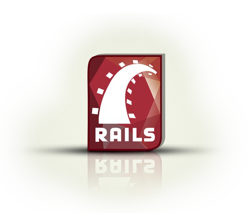

## Welcome to Ruby on Rails

The Ruby on Rails split up into two main sections: [Ruby language](https://github.com/mehdizebarjadan/Playing-with-Ruby-on-Rails/wiki/Ruby-language) , [Rails framework](https://github.com/mehdizebarjadan/Playing-with-Ruby-on-Rails/wiki/Rails-framework)

However, to utilize these two things together fully, we need a firm understanding of MVC, ORM, and [OOP](https://github.com/mehdizebarjadan/Playing-with-Ruby-on-Rails/wiki/OOP).

* **[Read more...](https://github.com/mehdizebarjadan/Playing-with-Ruby-on-Rails/wiki)**
